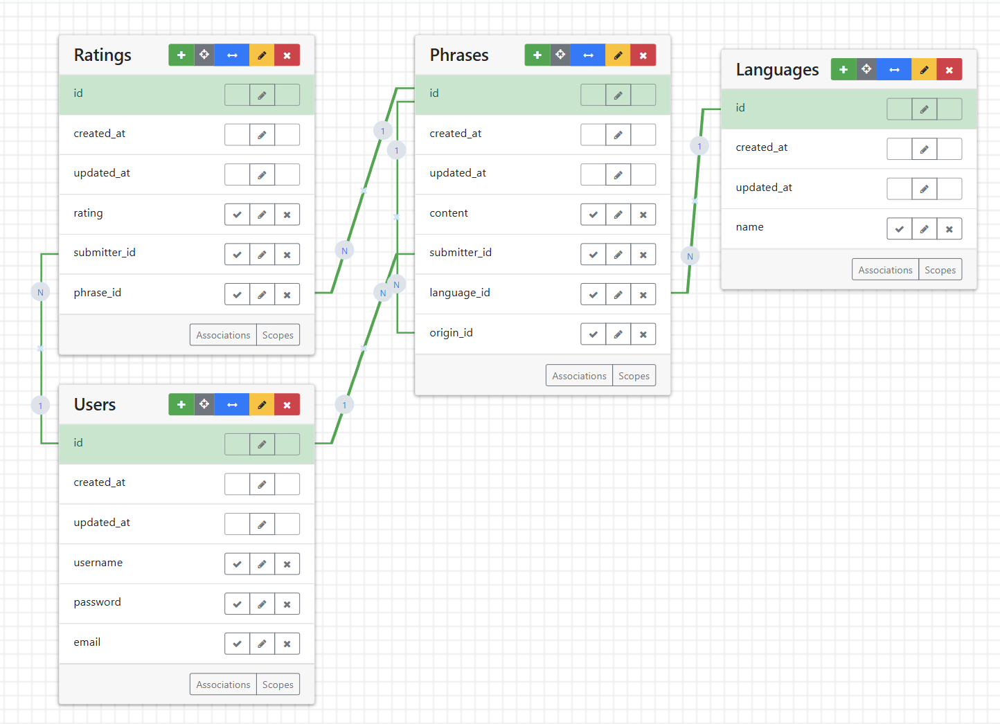

# Crowd Dictionary

<p>A dictionary website where users can submit and vote on translations for words and phrases for any language pair.</p>

## Table of Contents
1.   [Setup and Installation](#setup)
2.   [ERD](#erd)
3.   [Contribute](#contribute)
4.   [API Endpoints](#api)

***

### Setup and Installation <a name="setup"></a>

1.    Install Ruby: follow instructions [here](https://www.ruby-lang.org/en/documentation/installation/)
2.    Install Rails: 
    run ```gem install rails``` in a terminal
3.    Clone this repository: run ```git clone https://github.com/merrillhuang/crowd_dictionary.git```
4.    Start your application locally by running ```bundle exec rails server``` in a terminal. Access it in a browser by visitng ```localhost:3000```
  <ul>Note: this application uses Github OAuth. Sign-in/Sign-up will not work until you either [get your own GitHub OAuth Client ID and Client Secret](https://docs.github.com/en/apps/oauth-apps/building-oauth-apps/authenticating-to-the-rest-api-with-an-oauth-app#registering-your-app) or comment out ```config.omniauth :github, ENV.fetch("GITHUB_ID"), ENV.fetch("GITHUB_SECRET"), scope: "user"``` in devise.rb.
  </ul>
6.    Set up the database and associated models by running ```rake db:migrate``` in a terminal.
7.    (Optional) Seed your database with data by running ```rails db:seed``` for a small amount of data or ```rake sample_data``` for a larger amount of data. <strong>Be careful when using the rake sample_data command, as it will delete all your existing data</strong>. Only use it when seeding the application for the first time or when starting fresh.
***

### ERD <a name="erd"></a>



<p>Please note for the Phrases table: There are two types of Phrases - <strong>origin words/phrases</strong> and <strong>translations</strong>. Origin words are denoted by having a <strong>nil origin_id</strong>, translations' origin_ids correspond to the id of the origin word for which they are a translation. </p>

***

### Contributing to this project <a name="contribute"></a>
1.    Email <strong>Merrill Huang</strong> (merrill.huang@gmail.com) to request to be added as a contributor to this project.
2.    Coding Style Conventions: This project uses the [RuboCop](https://rubocop.org/) linter and follows the community [Ruby Style Guide](https://rubystyle.guide/).
3.    Issues/Branches: Please request new features by creating a Github Issue. Feature branches are to be named in the format {issue-number}-{initials-of-contributor}-{name-of-feature}.
4.    Pull Requests: Pull requests are reviewed by at least one project contributor before merging is allowed.

***

### API Endpoints <a name="api"></a>

| Route | Function | Notes |
| :----- | :----- | :----- |
| <strong>POST</strong> /phrases | Adds a new origin word or translation to the database | Only accessible by logged in users, must include params for content of new phrase and language_id of language it belongs to |
| <strong>GET</strong> /phrase_search?origin_word=[content]&starting_language=[starting_language_id]&target_language=[target_language_id] | Searches the database for the given origin_word from the starting_language and returns a list of translations in target_language. | If origin_word for starting_language doesn't exist, redirected to page to add origin_word to database |
| <strong>GET</strong> /phrases/[phrase_id] | Returns a list of languages that have translations for the phrase with the given phrase_id | Accessible by all users |
| <strong>GET</strong> /phrases/[phrase_id]?target_language=[target_language_id] | Returns a list of translations for the phrase with the given phrase_id in target_language | Accessible by all users |
| <strong>POST</strong> /ratings | Adds a new rating for a phrase to the database | Only accessible by logged in users, must include params for rating_val and associated phrase_id and submitter_id |
| <strong>GET</strong> /languages | Returns a list of all languages currently in the database | Accessible by all users |
| <strong>GET</strong> /languages/[language_id] | Returns a list of the top 5 most tranlsated words for the language with the given language_id as well as all origin_words for this language | Accessible by all users |
| <strong>POST</strong> /languages | Adds a new language to the database | Only accessible by logged in users, must include param for nam of new language |
| <strong>GET</strong> /users/[user_id] | Returns list of translations submitted by user with given user_id | Accessibly by all users |
| <strong>POST</strong> /users | Adds a new user to the database | Must include params for user's email, password, username |
